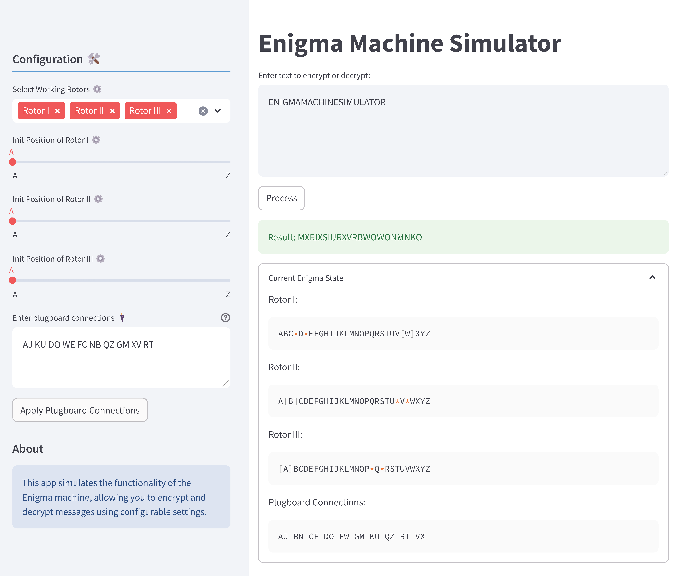

# Toy Enigma Simulator

This project simulates the functionality of the historical Enigma machine, allowing you to encrypt and decrypt messages using configurable settings. The simulation is built using Streamlit for real-time feedback.

### App Screenshot



### About

This app simulates the Enigma machine used during World War II for secure communication. It allows you to experience how messages were encrypted and decrypted using a configurable set of rotors and plugboard connections.

### Features

- Choose 3 out of 5 available rotors for encryption/decryption
- Set initial positions for the chosen rotors
- Configure plugboard connections
- Real-time encryption and decryption of messages
- Display of current Enigma machine state

### Project Structure

- `Toy_Enigma_Simulator`/
  
  - `streamlit_layout/`: Contains layout and view-related code.
  
    - `sidebar.py`: Configuration and settings displayed in the sidebar.
    - `main_view.py`: Main encryption/decryption interface.
    - `utils.py`: Utility functions used by the sidebar and main view.
  
  - `src/`: Core Enigma machine logic.
    - `enigma.py`: Core logic for the Enigma machine, including rotor mechanisms and encryption/decryption functions.
    - `plugboard.py`: Definition and operations of Enigma machine's plugboard for letter substitution.
    - `reflector.py`: Definition and operations of Reflector of the Enigma machine, which ensures reciprocal encryption.
    - `rotor.py`: Definition and operations of Rotors used in the Enigma machine, including stepping and wiring configurations.
  
  - `enigma_app.py`: Main entry point for the Streamlit application.

### Installation

To run this project locally, follow these steps:

1. Clone the repository:

    ```bash
    git clone https://github.com/ANKer661/Toy_Enigma_Simulator.git
    cd Toy_Enigma_Simulator
    ```

2. Install the required dependencies:

    ```bash
    pip install streamlit
    ```

3. Run the Streamlit app:

    ```bash
    streamlit run enigma_app.py
    ```

Or try out the [online demo](https://anker661-toy-enigma-simulator-enigma-app-8skqnu.streamlit.app/) to see the Toy Enigma Simulator in action!

### Usage
Open the Streamlit app in your web browser.
- Configure the Enigma machine settings in the sidebar:
  - Select 3 working rotors from the available 5.
  - Set the initial positions for the chosen rotors.
  - Enter plugboard connections in the specified format (e.g., AB CD EF).
- Enter the text you wish to encrypt or decrypt in the main interface.
- Click the "Process" button to view the result.
- Expand the "Current Enigma State" section to see the current configuration of the Enigma machine.


### License
This project is licensed under the MIT License. See the LICENSE file for details.
